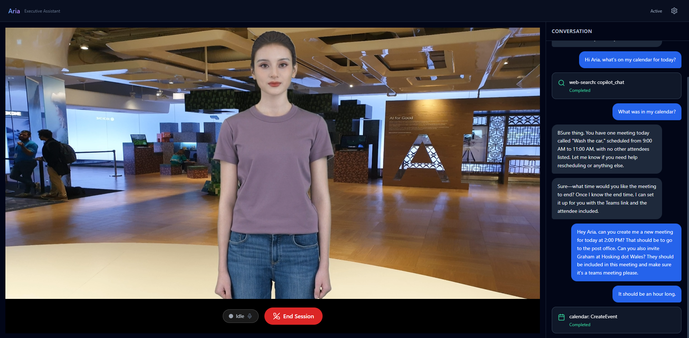

# Avatar Foundry

An autonomous AI Executive Assistant with HD avatar and real-time voice, powered by Microsoft Foundry.

**Aria** is a full-body, photorealistic AI assistant that can see, hear, and speak — built on Azure's Voice Live API, GPT-5 Realtime, and the Meg Casual avatar via WebRTC.

> **Not just retrieval — fully actionable.** Aria goes beyond read-only access to your Microsoft 365 data. Powered by Work IQ MCP servers, she can take real actions on your behalf: sending emails, creating meetings, and updating your calendar — capabilities that go beyond today's Microsoft Copilot experiences.

## Demo



> "Hey Aria, what's on my calendar today?"

Aria responds with natural speech and lip-synced HD avatar video in real-time. She can manage your calendar, search the web, send emails, and handle Teams meetings — all through voice.

## Actionable via WorkIQ

Aria is not limited to retrieving information — she is **fully actionable** via Work IQ MCP servers. Using delegated Entra ID (OBO) tokens, she can act on your behalf across Microsoft 365:

| Capability | Example |
|------------|---------|
| 📧 **Send emails** | *"Aria, send a follow-up email to the team with a summary of today's meeting."* |
| 📅 **Create meetings** | *"Schedule a 30-minute sync with John for Thursday at 2pm."* |
| ✏️ **Update meetings** | *"Move my 3pm call tomorrow to 4pm and add Sarah to the invite."* |
| 📬 **Read & search mail** | *"Do I have anything urgent from my manager this week?"* |
| 👥 **Look up people** | *"Find the contact details for the engineering lead."* |
| 🔍 **Web search** | *"What are the latest Azure AI pricing changes?"* |

> **Beyond today's Copilot:** As of March 2026, Microsoft Copilot remains largely read-only for many M365 actions. Aria, powered by Work IQ, can create and send emails, create and reschedule meetings, and take write actions across M365 — all through natural voice conversation with a photorealistic HD avatar. This is a capability gap that sets this solution apart.

## Architecture

```
┌─────────────────────────────────────────────────────────────────┐
│  Browser (React + TypeScript + Vite)                            │
│  ┌──────────┐  ┌──────────────┐  ┌───────────────────────────┐  │
│  │  MSAL    │  │ Conversation │  │  Avatar (WebRTC)          │  │
│  │  Auth    │  │ Panel        │  │  - HD video (H.264)       │  │
│  └──────────┘  └──────────────┘  │  - TTS audio output       │  │
│                                   └───────────────────────────┘  │
│  ┌──────────────────────────────────────────────────────────┐    │
│  │  Mic Capture (AudioWorkletNode → PCM16 → WebSocket)     │    │
│  └──────────────────────────────────────────────────────────┘    │
└───────────────────────────┬──────────────────────────────────────┘
                            │ WebSocket
┌───────────────────────────▼──────────────────────────────────────┐
│  Backend (Express + TypeScript)                                  │
│  ┌──────────────────────────────────────────────────────────┐    │
│  │  WebSocket Proxy (/ws/voice-live)                        │    │
│  │  - Entra ID auth (DefaultAzureCredential)                │    │
│  │  - OBO token exchange for Work IQ MCP                    │    │
│  │  - session.update → Voice Live API (with MCP tools)      │    │
│  │  - Bidirectional message forwarding                      │    │
│  └──────────────────────────────────────────────────────────┘    │
│  REST: /api/health, /api/avatar/config, /api/avatar/ice         │
└───────────────────────────┬──────────────────────────────────────┘
                            │ WSS (Bearer token)
┌───────────────────────────▼──────────────────────────────────────┐
│  Azure Voice Live API (2026-01-01-preview)                       │
│  ┌────────────┐  ┌──────────────┐  ┌─────────────────────────┐  │
│  │ GPT-5      │  │ Dragon HD    │  │ Meg Casual Avatar       │  │
│  │ Realtime   │  │ Ava Voice    │  │ (WebRTC SDP exchange)   │  │
│  │ (reasoning)│  │ (TTS)        │  │ 29 gestures, full-body  │  │
│  └────────────┘  └──────────────┘  └─────────────────────────┘  │
│  ┌──────────────────────────────────────────────────────────┐    │
│  │  Work IQ MCP Tools (via OBO delegation)                  │    │
│  │  Calendar · Mail · Teams · People · Web Search           │    │
│  └──────────────────────────────────────────────────────────┘    │
└──────────────────────────────────────────────────────────────────┘
```

## Tech Stack

| Layer | Technology |
|-------|-----------|
| Frontend | React 19, TypeScript, Vite 6, Tailwind CSS 3 |
| Backend | Express 5, TypeScript, WebSocket (ws) |
| Auth | MSAL.js v5 (Entra ID redirect + OBO flow) |
| Voice | Voice Live API, Dragon HD Ava Neural voice |
| Avatar | Meg Casual, WebRTC (H.264), base64-encoded SDP |
| LLM | GPT-5 Realtime (`gpt-realtime-1.5`) |
| Tools | Work IQ MCP servers (Calendar, Mail, Teams, People, Web Search) |
| Infrastructure | Bicep (Azure AI Services, App Service, Static Web Apps) |

## Prerequisites

- **Node.js** >= 20
- **Azure CLI** logged in (`az login`)
- **Azure AI Services** resource in a [supported region](https://learn.microsoft.com/azure/ai-services/speech-service/text-to-speech-avatar/standard-avatars) (eastus2, westus2, northeurope, swedencentral, southeastasia, southcentralus, westeurope)
- **App Registration** with SPA redirect URI (`http://localhost:3000`)
- RBAC: **Cognitive Services User** + **Azure AI User** on the AI Services resource

## Quick Start

```bash
# Clone and install
git clone https://github.com/ITSpecialist111/Aria-Avatar-Foundry-WorkIQ.git
cd Avatar-Foundry
npm install

# Configure environment
cp .env.example .env
# Edit .env with your Azure resource values (see Environment section below)

# Run development servers
npm run dev
# Client: http://localhost:3000
# Server: http://localhost:8080
```

## Environment Variables

Copy `.env.example` to `.env` and fill in:

| Variable | Required | Description |
|----------|----------|-------------|
| `AZURE_TENANT_ID` | Yes | Entra ID tenant |
| `VOICELIVE_ENDPOINT` | Yes | AI Services custom domain (`https://<name>.cognitiveservices.azure.com`) |
| `SPEECH_REGION` | Yes | Azure region (`eastus2`) |
| `MSAL_CLIENT_ID` | Yes | App registration client ID |
| `MSAL_CLIENT_SECRET` | Yes* | App registration secret (required for OBO/MCP tools) |
| `MSAL_TENANT_ID` | Yes | Same as `AZURE_TENANT_ID` |
| `VITE_MSAL_CLIENT_ID` | Yes | Same as `MSAL_CLIENT_ID` (for Vite) |
| `VITE_MSAL_TENANT_ID` | Yes | Same as `AZURE_TENANT_ID` (for Vite) |
| `WORKIQ_ENVIRONMENT_ID` | No* | Power Platform environment ID (required for MCP tools) |
| `VOICELIVE_MODEL` | No | Realtime model deployment name (default: `gpt-4o-realtime-preview`) |
| `VOICE_NAME` | No | TTS voice (default: `en-US-Ava:DragonHDLatestNeural`) |
| `AVATAR_CHARACTER` | No | Avatar character (default: `meg`) |
| `AVATAR_STYLE` | No | Avatar style (default: `casual`) |
| `AVATAR_BACKGROUND_URL` | No | Public URL for avatar background image (rendered server-side into video stream) |
| `PROJECT_NAME` | No | Foundry project name (enables agent mode with tools) |

## Scripts

```bash
npm run dev      # Start client + server in development mode
npm run build    # Production build (both packages)
npm run lint     # Lint both packages
npm run clean    # Remove dist/ from both packages
```

## Project Structure

```
Avatar-Foundry/
├── client/                    # React frontend
│   ├── src/
│   │   ├── App.tsx            # Main app (login screen + main UI)
│   │   ├── auth/              # MSAL config
│   │   ├── components/        # AvatarView, ConversationPanel, StatusBar, DemoControls
│   │   ├── hooks/             # useVoiceLive (WebRTC + WebSocket + mic capture)
│   │   └── types/             # Shared TypeScript types
│   └── vite.config.ts
├── server/                    # Express backend
│   ├── src/
│   │   ├── index.ts           # Express + WebSocket proxy
│   │   ├── config/env.ts      # Zod environment validation
│   │   └── services/
│   │       ├── voiceLive.ts   # Voice Live session config + connection
│   │       └── foundryAgent.ts # Aria system prompt + agent metadata
│   └── tsconfig.json
├── infra/                     # Bicep IaC templates
│   ├── main.bicep
│   └── parameters.json
├── .env.example               # Environment template
├── CLAUDE.md                  # AI assistant instructions
└── HANDOVER.md                # Detailed technical handover document
```

## Key Features

- **HD Avatar** — Photorealistic Meg Casual avatar with natural idle animations and lip sync
- **Real-time Voice** — Sub-200ms latency bidirectional voice via Voice Live API
- **Dragon HD Voice** — `en-US-Ava:DragonHDLatestNeural` with 100+ speaking styles
- **Fully Actionable via Work IQ** — Goes beyond retrieval: send emails, create/update/move meetings, and more via delegated M365 MCP tools — surpassing today's Copilot read-only capabilities
- **Barge-in** — Interrupt the assistant mid-sentence; audio cuts instantly
- **Tool Call Audio Cue** — Two-tone chime when MCP tool execution begins
- **Auto-Retry** — Automatic response recovery when VAD cancels tool call responses
- **Noise Suppression** — Azure Deep Noise Suppression on mic input
- **Echo Cancellation** — Server-side echo cancellation (works with WebRTC avatar audio)
- **VAD Tuning** — Configurable threshold (0.8), silence duration (1200ms), and prefix padding (500ms)
- **Mute** — Send silence when muted (keeps server_vad alive)
- **MSAL Auth** — Enterprise SSO via Entra ID redirect flow + OBO for M365 delegation
- **Proactive Greeting** — Aria introduces herself on session start
- **Conversation Panel** — Auto-scrolling transcript with VQ token filtering

## Modes

### Inline Mode (default)
No Foundry project or MCP tools needed. The system prompt is sent directly in `session.update` with explicit "no tools available" instructions. Voice works conversationally but cannot access M365 data.

### MCP Tools Mode (with `WORKIQ_ENVIRONMENT_ID`)
Work IQ MCP servers (Calendar, Mail, etc.) are injected directly into the Voice Live `session.update` as tool definitions. Uses OBO token exchange for delegated M365 access. No separate Foundry Agent needed — GPT-5 Realtime calls MCP tools directly.

### Agent Mode (with `PROJECT_NAME`)
Connects to a Foundry Agent for reasoning and tool calling. Voice Live handles the realtime voice; the agent handles LLM reasoning. Note: GPT-5 not yet supported as Foundry Agent model.

## Known Issues

- **VQ Token Artifacts** — GPT-5 Realtime occasionally leaks `<|vq_...|>` tokens or "audio text" into speech. Mitigated with 3-layer defense (system prompt + server filter + client filter) but still model-level.
- **GPT-5 Agent Support** — GPT-5 not yet available as a Foundry Agent chat model (`DeploymentModelNotSupported`). Use inline + MCP tools mode instead.
- **WebRTC Timeout** — Avatar WebRTC disconnects after 5min idle / 30min total. Auto-reconnect not yet implemented.
- **Avatar Gestures** — 29 gestures available for Meg Casual but batch synthesis only. Not supported in real-time/Voice Live mode (natural idle animations only).

## Azure Resources

| Resource | Type | Region |
|----------|------|--------|
| `ai-avatar-foundry-ghosking` | AI Services | eastus2 |
| Foundry Project: `avatar-foundry` | AI Foundry | eastus2 |

### Model Deployments
| Name | Model | SKU |
|------|-------|-----|
| `gpt-realtime` | GPT-4o Realtime (2025-08-28) | GlobalStandard |
| `gpt-realtime-1.5` | GPT-5 Realtime (2026-02-23) | GlobalStandard |
| `gpt-4o` | GPT-4o (2024-08-06) | GlobalStandard |

## Documentation

- [HANDOVER.md](./HANDOVER.md) — Detailed technical handover with architecture decisions, fixes, and known issues
- [Voice Live API Reference](https://learn.microsoft.com/azure/ai-services/speech-service/voice-live-api-reference-2026-01-01-preview)
- [Voice Live Agents Quickstart](https://learn.microsoft.com/azure/ai-services/speech-service/voice-live-agents-quickstart)
- [Standard Avatars](https://learn.microsoft.com/azure/ai-services/speech-service/text-to-speech-avatar/standard-avatars)
- [Work IQ MCP Servers](https://learn.microsoft.com/microsoft-agent-365/tooling-servers-overview)

## License

Private — Internal use only.
